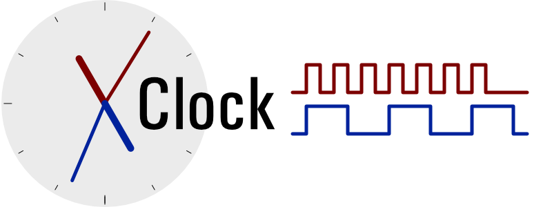

# XClock - Synchronizing eXperimental Clocks



**XClock** is a Python package designed to help synchronize data acquisition clocks in experimental setups, particularly for neuroscience and behavioral experiments. It provides tools to generate precise clock signals using various data acquisition (DAQ) devices.

```{note}
This Python project is not the [clock for the original X Window System](https://www.x.org/archive/X11R7.6/doc/man/man1/xclock.1.xhtml).
```

[](https://github.com/brain-bremen/XClock/actions/workflows/python-tests.yml)

## Key Features

- **Multiple Synchronized Clocks**: Output multiple clock frequencies simultaneously, all synchronized to the same internal clock source to ensure precise timing alignment
- **Timestamp Recording**: Record the timestamps of clock pulses relative to the internal DAQ device clock
- **Flexible Control**: Use as a Python library or command-line tool
- **Device Support**: Currently supports LabJack T4 with easy extension for other devices
- **Trigger Support**: Start clocks on external trigger signals
- **Pulsed or Continuous**: Generate a specific number of pulses or run continuously

## Use Cases

The generated output pulses can be used to:

- Trigger and synchronize industrial cameras used for behavioral monitoring
- Synchronize two-photon imaging systems
- Coordinate multiple data acquisition devices in complex experimental setups
- Maintain precise timing across distributed experimental equipment

## Quick Start

### Installation

```bash
# Install via pip
pip install git+http://github.com/brain-bremen/XClock.git

# Install via uv (recommended)
uv add git+https://github.com/brain-bremen/XClock.git
```

### Basic Usage

```python
from xclock.devices import LabJackT4

# Create device and add clocks
t4 = LabJackT4()
channels = t4.get_available_output_clock_channels()

# Add 100 Hz clock for 10 seconds
t4.add_clock_channel(
    clock_tick_rate_hz=100,
    channel_name=channels[0],
    duration_s=10.0,
)

# Start and record timestamps
t4.start_clocks_and_record_edge_timestamps(
    wait_for_pulsed_clocks_to_finish=True,
    filename="timestamps.csv"
)
```

## Documentation Contents

```{toctree}
:maxdepth: 2
:caption: User Guide

user/installation
user/quickstart
user/cli
user/gui
user/devices
```

```{toctree}
:maxdepth: 2
:caption: Developer Guide

developer/adding_devices
developer/architecture
developer/contributing
```

```{toctree}
:maxdepth: 2
:caption: API Reference

api/devices
api/edge_detection
api/errors
```

## Indices and Tables

- {ref}`genindex`
- {ref}`modindex`
- {ref}`search`

## License

XClock is licensed under the MIT License. See the [LICENSE](https://github.com/brain-bremen/XClock/blob/main/LICENSE) file for details.

## Links

- [GitHub Repository](https://github.com/brain-bremen/XClock)
- [Issue Tracker](https://github.com/brain-bremen/XClock/issues)
- [Changelog](https://github.com/brain-bremen/XClock/releases)