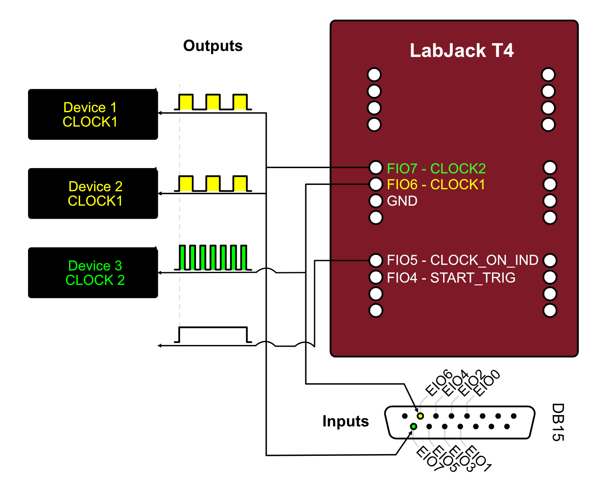

# Device Support

XClock supports various data acquisition (DAQ) devices for clock generation. This page provides device-specific information, wiring diagrams, and configuration details.

## Supported Devices

### LabJack T4

The LabJack T4 is the primary supported device for XClock. It's a USB-based data acquisition device with excellent timing precision.

**Specifications:**
- Base clock frequency: 80 MHz
- Available output channels: 8 flexible I/O (FIO0-7) + 4 extended I/O (EIO0-3)
- Trigger input: DIO4
- Maximum clock frequency: Limited by divisor calculations
- Minimum clock frequency: ~1 Hz

**Advantages:**
- Affordable and widely available
- USB-powered, no external power needed
- Cross-platform support (Windows, macOS, Linux)
- Precise internal clock
- Multiple simultaneous outputs

#### Wiring Diagram



**Recommended Wiring:**
- **Clock Outputs**: FIO0, FIO1, FIO2, FIO3 (first 4 channels recommended)
- **Trigger Input**: DIO4 (for external trigger start)
- **Ground**: GND (connect to equipment ground)
- **Power**: USB (no additional power needed)

#### Pin Configuration

| Pin Name | Function | Type | Description |
|----------|----------|------|-------------|
| FIO0-7 | Clock Output | Output | Flexible I/O, can be used for clock signals |
| EIO0-3 | Clock Output | Output | Extended I/O, additional clock channels |
| DIO4 | Trigger Input | Input | External trigger for synchronized start |
| GND | Ground | - | Common ground reference |
| VS | Power Out | Output | 5V output (USB power) |

#### Available Channels

Query available channels in Python:

```python
from xclock.devices import LabJackT4

t4 = LabJackT4()
output_channels = t4.get_available_output_clock_channels()
print(f"Clock outputs: {output_channels}")
# Output: ('FIO0', 'FIO1', 'FIO2', 'FIO3', 'EIO0', 'EIO1', 'EIO2', 'EIO3')

trigger_channels = t4.get_available_input_start_trigger_channels()
print(f"Trigger inputs: {trigger_channels}")
# Output: ('DIO4',)
```

#### Clock Frequency Limitations

The LabJack T4 uses a divisor-based system for generating clocks from the 80 MHz base clock. Not all frequencies are achievable exactly.

**Achievable frequencies:**
- Frequency = 80,000,000 Hz / (divisor × roll_value)
- Divisor: 1, 2, 4, 8, 16, 32, 64, 256
- Roll value: 1-65536

XClock automatically calculates the closest achievable frequency:

```python
channel = t4.add_clock_channel(clock_tick_rate_hz=100, ...)
print(f"Requested: 100 Hz")
print(f"Actual: {channel.actual_sample_rate_hz} Hz")
```

#### Example: Basic LabJack T4 Usage

```python
from xclock.devices import LabJackT4

# Initialize
t4 = LabJackT4()

# Add two synchronized clocks
t4.add_clock_channel(
    clock_tick_rate_hz=60,
    channel_name="FIO0",
    duration_s=10.0,
)

t4.add_clock_channel(
    clock_tick_rate_hz=100,
    channel_name="FIO1",
    duration_s=10.0,
)

# Start and wait
t4.start_clocks(wait_for_pulsed_clocks_to_finish=True)
t4.close()
```

#### Troubleshooting LabJack T4

**Device not found:**
- Install [LabJack LJM software](https://support.labjack.com/docs/ljm-software-installer-downloads-t4-t7-t8-digit)
- Check USB connection
- Test with Kipling software (included with LJM)

**Permission errors (Linux):**
- Set up udev rules for USB access (see {doc}`installation`)

**Unexpected frequencies:**
- Check `actual_sample_rate_hz` to see achieved frequency
- Try different target frequencies
- Some frequencies may not be exactly achievable

### Dummy DAQ Device

A software-only device for testing and development without hardware.

**Features:**
- Simulates all XClock functionality
- No hardware required
- Same API as real devices
- Useful for unit tests and development

**Limitations:**
- No actual output signals
- Timestamps are simulated
- Cannot trigger external equipment

#### Example: Using Dummy Device

```python
from xclock.devices import DummyDaqDevice

# Initialize dummy device
dummy = DummyDaqDevice()

# Use exactly like a real device
dummy.add_clock_channel(clock_tick_rate_hz=100, duration_s=5.0)
dummy.start_clocks(wait_for_pulsed_clocks_to_finish=True)
dummy.close()
```

**Use cases:**
- Testing code without hardware
- Development and debugging
- Automated testing
- Learning XClock API

## Device Comparison

| Feature | LabJack T4 | Dummy Device |
|---------|------------|--------------|
| Hardware required | Yes | No |
| Actual outputs | Yes | No (simulated) |
| Timestamp accuracy | High (ns) | Simulated |
| Cost | ~$200 | Free |
| Platform support | All | All |
| Max channels | 12 | Unlimited |
| Trigger input | Yes | Simulated |

## Connection Examples

### Single Camera Synchronization

Connect one camera trigger input to LabJack FIO0:

```
LabJack T4          Camera
---------          --------
FIO0     ------>   Trigger In
GND      ------>   Ground
```

### Multi-Camera Setup

Connect multiple cameras to different channels:

```
LabJack T4          Devices
---------          --------
FIO0     ------>   Camera 1 Trigger
FIO1     ------>   Camera 2 Trigger
FIO2     ------>   DAQ System Trigger
GND      ------>   Common Ground
```

### External Trigger Start

Use external signal to start all clocks simultaneously:

```
Trigger Source     LabJack T4          Cameras
--------------     ----------          -------
Trigger Out ----> DIO4
                   FIO0      ------>   Camera 1
                   FIO1      ------>   Camera 2
                   GND       ------>   Common Ground
```

## Electrical Specifications

### LabJack T4 Output

- **Logic level**: 3.3V (TTL compatible)
- **High level**: ~3.3V
- **Low level**: ~0V
- **Output current**: Max 6 mA per pin
- **Rise/fall time**: ~20 ns

```{warning}
Do not exceed maximum output current. Use buffer circuits if driving high-current loads.
```

### Signal Buffering

For driving long cables or multiple devices, use a buffer:

```
LabJack FIO0 --> 74HCT244 Buffer --> Camera Triggers (multiple)
```

Recommended buffer ICs:
- 74HCT244 (non-inverting)
- 74HCT541 (non-inverting)
- SN74LVC244A (low voltage)

## Device-Specific Best Practices

### LabJack T4

**Do:**
- Use FIO0-3 first (most reliable for clocks)
- Keep cables short (<2m) for best signal integrity
- Connect grounds between all devices
- Test frequencies with short pulses first
- Monitor `actual_sample_rate_hz` for frequency accuracy

**Don't:**
- Exceed 6 mA output current per pin
- Apply voltages >3.6V to any pin
- Use extremely long USB cables (>5m)
- Hot-plug while clocks are running

### General

**Do:**
- Always call `close()` when done
- Use `with` statements for automatic cleanup (if supported)
- Check available channels before adding clocks
- Validate wiring before starting clocks
- Record timestamps for critical synchronization

**Don't:**
- Add more clocks than available channels
- Mix continuous and pulsed clocks without planning
- Ignore actual vs. requested frequencies
- Share ground connections with noisy equipment

## Performance Characteristics

### Timing Accuracy

**LabJack T4:**
- Base clock: 80 MHz ± 20 ppm
- Jitter: <1 µs
- Channel-to-channel skew: <100 ns
- Long-term drift: <50 ppm/°C

### Timestamp Resolution

When recording timestamps:
- Resolution: 1 ns (nanosecond)
- Accuracy: Limited by base clock accuracy
- Format: 64-bit signed integer

## Future Device Support

Planned support for additional devices:

- **National Instruments DAQ**: USB-6001, USB-6008, USB-6343
- **LabJack T7**: Higher precision version of T4
- **Arduino-based**: Low-cost alternative
- **Raspberry Pi GPIO**: Software-timed clocks

```{note}
See {doc}`../developer/adding_devices` for information on adding support for new devices.
```

## See Also

- {doc}`installation` - Installing device drivers
- {doc}`quickstart` - Basic usage examples
- {doc}`../developer/adding_devices` - Adding new device support
- {doc}`../api/devices` - Device API reference